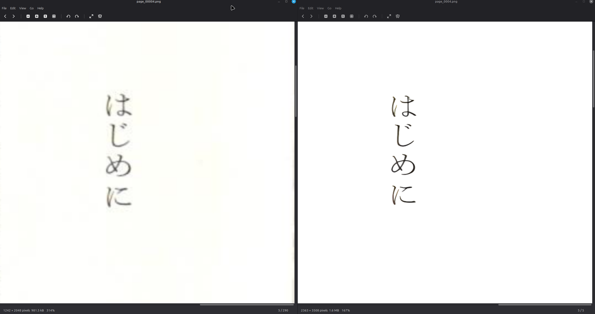
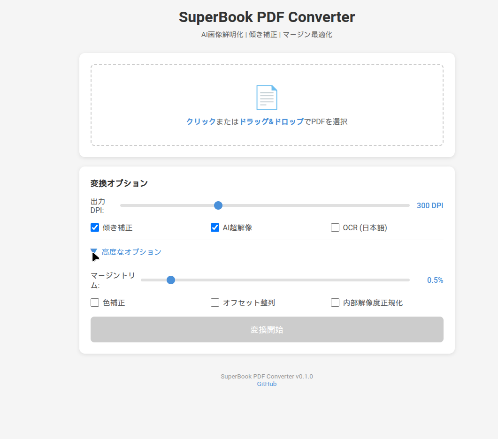

<p align="center">
  <b>🌐 語言</b><br>
  <a href="../../README.md">日本語</a> |
  <a href="README.en.md">English</a> |
  <a href="README.zh-CN.md">简体中文</a> |
  <b>繁體中文</b> |
  <a href="README.ru.md">Русский</a> |
  <a href="README.uk.md">Українська</a> |
  <a href="README.fa.md">فارسی</a> |
  <a href="README.ar.md">العربية</a>
</p>

# superbook-pdf

[](https://www.gnu.org/licenses/agpl-3.0)
[](https://www.rust-lang.org/)
[](https://github.com/sfuruki/Rust_DN_SuperBook_Reforge/actions/workflows/ci.yml)

> **Fork 傳承關係：**
>
> - [dnobori/DN_SuperBook_PDF_Converter](https://github.com/dnobori/DN_SuperBook_PDF_Converter)（原始版）
> - [clearclown/Rust_DN_SuperBook_PDF_Converter](https://github.com/clearclown/Rust_DN_SuperBook_PDF_Converter)（Rust 分支）
>
> Rust_DN_SuperBook_Reforge 是沿著 DN_SuperBook_PDF_Converter 與 Rust_DN_SuperBook_PDF_Converter 脈絡延伸的派生專案。
>
> 它保留了原有的核心轉換功能，同時針對目前的執行環境重新整理結構與運作方式，讓後續擴充與維護更容易。
>
> 這個派生版主要著重於 AI 執行環境分離與 HTTP 微服務化、頁面層級的部分平行執行，以及 Web UI / WebSocket 進度顯示的細化。

**原作者:** 登 大遊 (Daiyuu Nobori)
**Rust 重寫:** clearclown
**派生與調整:** sfuruki
**授權:** AGPL v3.0

---

## 處理前 / 處理後



| | 處理前 (左) | 處理後 (右) |
|---|---|---|
| **解析度** | 1242x2048 px | 2363x3508 px |
| **檔案大小** | 981 KB | 1.6 MB |
| **品質** | 模糊、低對比度 | 清晰、高對比度 |

透過 RealESRGAN AI 超解析度技術，文字邊緣變得銳利，可讀性大幅提升。

---

## 功能特色

- **Rust 實作** - 從 C# 完全重寫，記憶體效率與效能大幅提升
- **AI 執行環境分離** - 將 RealESRGAN / YomiToku 自 Rust Core 分離，透過 Docker/Podman 以 HTTP 微服務方式運行
- **AI 超解析度** - 使用 RealESRGAN 進行 2 倍影像放大
- **日文 OCR** - 使用 YomiToku 進行高精度文字辨識
- **Markdown 轉換** - 從 PDF 產生結構化 Markdown（自動偵測圖表）
- **部分平行執行** - 支援頁面層級平行處理，可透過 `--threads` 與 `--chunk-size` 控制負載與記憶體使用量
- **進度顯示細化** - 在既有 Web UI / WebSocket 基礎上，細化各處理階段的進度與日誌顯示
- **傾斜校正** - 透過大津二值化 + 霍夫轉換自動校正
- **180度旋轉偵測** - 自動偵測和校正上下顛倒的頁面
- **陰影去除** - 自動偵測和去除裝訂陰影
- **標記去除** - 偵測和去除螢光筆標記
- **去模糊** - 銳化模糊影像 (Unsharp Mask / NAFNet / DeblurGAN-v2)
- **色彩校正** - HSV 透印抑制、紙張白化
- **Web UI** - 透過瀏覽器直覺操作

---

## 快速開始

```bash
# 從原始碼建置
git clone https://github.com/sfuruki/Rust_DN_SuperBook_Reforge.git
cd Rust_DN_SuperBook_Reforge/superbook-pdf
cargo build --release --features web

# 基本轉換
superbook-pdf convert input.pdf -o output/

# 高品質轉換（AI 超解析度 + 色彩校正 + 偏移對齊）
superbook-pdf convert input.pdf -o output/ --advanced --ocr

# Markdown 轉換
superbook-pdf markdown input.pdf -o markdown_output/

# 啟動 Web UI
docker compose up -d
```

---

## 指令體系

| 指令 | 說明 |
|------|------|
| `convert` | 使用 AI 增強 PDF 產生高品質 PDF |
| `markdown` | 從 PDF 產生結構化 Markdown |
| `reprocess` | 重新處理轉換失敗的頁面 |
| `info` | 顯示系統環境資訊 |
| `cache-info` | 顯示輸出 PDF 的快取資訊 |

---

## 處理流程

```
輸入 PDF
  |
  +- Step 1:  PDF 影像擷取 (pdftoppm)
  +- Step 2:  邊距修剪 (預設 0.7%)
  +- Step 3:  陰影去除
  +- Step 4:  AI 超解析度 (RealESRGAN 2x)
  +- Step 5:  去模糊
  +- Step 6:  180度旋轉偵測/校正
  +- Step 7:  傾斜校正 (大津二值化 + 霍夫轉換)
  +- Step 8:  色彩校正 (HSV 透印抑制)
  +- Step 9:  標記去除
  +- Step 10: 分組裁剪 (統一邊距)
  +- Step 11: PDF 生成 (JPEG DCT 壓縮)
  +- Step 12: OCR (YomiToku)
  |
  輸出 PDF
```

空白頁自動偵測（門檻 2%）並跳過所有處理。

---

## 指令詳細

### `convert` — PDF 高品質強化

```bash
# 基本（傾斜校正 + 邊距修剪 + AI 超解析度）
superbook-pdf convert input.pdf -o output/

# 最佳品質（所有功能啟用）
superbook-pdf convert input.pdf -o output/ --advanced --ocr

# 陰影去除 + 標記去除 + 去模糊
superbook-pdf convert input.pdf -o output/ --shadow-removal auto --remove-markers --deblur

# 測試（前 5 頁，僅顯示計劃）
superbook-pdf convert input.pdf -o output/ --max-pages 5 --dry-run
```

**主要選項：**

| 選項 | 預設值 | 說明 |
|------|-------|------|
| `-o, --output <DIR>` | `./output` | 輸出目錄 |
| `--advanced` | 關 | 高品質處理（內部解析度 + 色彩校正 + 偏移對齊） |
| `--ocr` | 關 | 日文 OCR |
| `--dpi <N>` | 300 | 輸出 DPI |
| `--jpeg-quality <N>` | 90 | PDF 中 JPEG 壓縮品質 (1-100) |
| `-m, --margin-trim <N>` | 0.7 | 邊距修剪百分比 (%) |
| `--shadow-removal <MODE>` | auto | 陰影去除模式 (none/auto/left/right/both) |
| `--remove-markers` | 關 | 螢光筆標記去除 |
| `--deblur` | 關 | 去模糊處理 |
| `--no-upscale` | — | 跳過 AI 超解析度 |
| `--no-deskew` | — | 跳過傾斜校正 |
| `--no-gpu` | — | 停用 GPU |
| `--dry-run` | — | 僅顯示執行計劃（不處理） |
| `--max-pages <N>` | — | 限制處理頁數 |

### `markdown` — PDF 轉換為 Markdown

```bash
# 基本轉換
superbook-pdf markdown input.pdf -o output/

# 指定縱排文字 + AI 超解析度
superbook-pdf markdown input.pdf -o output/ --text-direction vertical --upscale

# 恢復中斷的處理
superbook-pdf markdown input.pdf -o output/ --resume
```

**主要選項：**

| 選項 | 預設值 | 說明 |
|------|-------|------|
| `-o, --output <DIR>` | `./markdown_output` | 輸出目錄 |
| `--text-direction` | auto | 文字方向 (auto/horizontal/vertical) |
| `--upscale` | 關 | OCR 前先執行 AI 超解析度 |
| `--dpi <N>` | 300 | 輸出 DPI |
| `--figure-sensitivity <N>` | — | 圖片偵測靈敏度 (0.0-1.0) |
| `--no-extract-images` | — | 停用圖片擷取 |
| `--no-detect-tables` | — | 停用表格偵測 |
| `--validate` | 關 | 輸出 Markdown 品質驗證 |
| `--resume` | — | 恢復中斷的處理 |

### `reprocess` — 重新處理失敗頁面

```bash
# 自動偵測並重新處理
superbook-pdf reprocess output/.superbook-state.json

# 僅重新處理指定頁數
superbook-pdf reprocess output/.superbook-state.json -p 5,12,30

# 僅查看狀態
superbook-pdf reprocess output/.superbook-state.json --status
```

---

## 安裝

### 需求環境

| 項目 | 需求 |
|------|------|
| 作業系統 | Linux / macOS / Windows |
| Rust | 1.82+（從原始碼編譯） |
| Poppler | `pdftoppm` 指令 |

AI 功能需要 Python 3.10+ 及 NVIDIA GPU（CUDA 11.8+）。

### 1. 系統相依性

```bash
# Ubuntu/Debian
sudo apt update && sudo apt install -y poppler-utils python3 python3-venv

# Fedora
sudo dnf install -y poppler-utils python3

# macOS (Homebrew)
brew install poppler python

# Windows (Chocolatey)
choco install poppler python
```

### 2. 安裝 superbook-pdf

```bash
git clone https://github.com/clearclown/Rust_DN_SuperBook_PDF_Converter.git
cd Rust_DN_SuperBook_PDF_Converter/superbook-pdf
cargo build --release --features web
```

### 3. 透過 Docker/Podman 執行（建議）

```bash
# NVIDIA GPU
docker compose up -d

# AMD GPU (ROCm)
docker compose -f docker-compose.yml -f docker-compose.rocm.yml up -d

# 僅 CPU
docker compose -f docker-compose.yml -f docker-compose.cpu.yml up -d
```

在瀏覽器開啟 http://localhost:8080。

---

## Web UI



瀏覽器介面，只需拖放檔案即可開始轉換。支援 WebSocket 即時進度顯示。

```bash
# 建議：前端 (Nginx) + 後端 (Rust API/WS)
docker compose up -d

# 直接模式：僅啟動後端 API/WS 伺服器
superbook-pdf serve --port 8080 --bind 0.0.0.0
```

---

## 文件

| 文件 | 內容 |
|------|------|
| [docs/pipeline.md](../pipeline.md) | 處理流程詳細設計 |
| [docs/commands.md](../commands.md) | 完整指令及選項參考 |
| [docs/configuration.md](../configuration.md) | 設定檔自訂 (TOML) |
| [docs/docker.md](../docker.md) | Docker/Podman 環境詳細指南 |
| [docs/development.md](../development.md) | 開發者指南（編譯、測試、架構） |

---

## 問題排除

| 問題 | 解決方法 |
|------|----------|
| `pdftoppm: command not found` | `sudo apt install poppler-utils` |
| RealESRGAN 無法運作 | 以 `docker compose ps` 及 `superbook-pdf info` 檢查 AI 服務 |
| GPU 未被使用 | 檢查 `docker compose ps` 及 `nvidia-smi`；必要時使用 CPU 模式 (`-f docker-compose.cpu.yml`) |
| 記憶體不足 | 使用 `--max-pages 10` 或 `--chunk-size 5` |
| Deskew 造成影像歪曲 | 以 `--no-deskew` 停用 |
| 邊距裁切到文字 | 增加安全緩衝：`--margin-safety 1.0` |

---

## 授權

AGPL v3.0 — [LICENSE](../../LICENSE)

---

## 致謝

- **Daiyuu Nobori** — 原始實作
- **[RealESRGAN](https://github.com/xinntao/Real-ESRGAN)** — AI 超解析度
- **[YomiToku](https://github.com/kotaro-kinoshita/yomitoku)** — 日文 OCR
  +- Step 10: 分組裁剪 (統一邊距)
  +- Step 11: PDF 產生 (JPEG DCT 壓縮)
  +- Step 12: OCR (YomiToku)
  |
  輸出 PDF
```

---

## 安裝

### Docker/Podman 執行（建議）

```bash
# NVIDIA GPU
docker compose up -d

# AMD GPU (ROCm)
docker compose -f docker-compose.yml -f docker-compose.rocm.yml up -d

# 僅 CPU
docker compose -f docker-compose.yml -f docker-compose.cpu.yml up -d
```

在瀏覽器中開啟 http://localhost:8080。

---

## 授權

AGPL v3.0 - [LICENSE](../../LICENSE)

## 致謝

- **登 大遊 (Daiyuu Nobori)** - 原始實作
- **[RealESRGAN](https://github.com/xinntao/Real-ESRGAN)** - AI 超解析度
- **[YomiToku](https://github.com/kotaro-kinoshita/yomitoku)** - 日文 OCR
